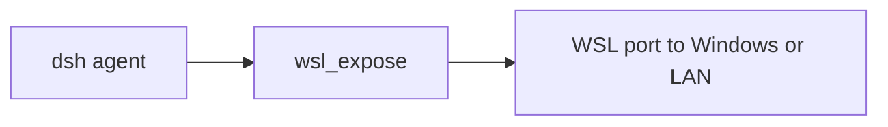

# dsh-wsl-expose

> **Install set:** part of [dsh-wsl-kit](https://github.com/173787247/dsh-wsl-kit). Prefer `KIT_SET=llm` | `full`. Fault tree: [TROUBLESHOOTING.md](https://github.com/173787247/dsh-wsl-kit/blob/master/docs/TROUBLESHOOTING.md).

DeepSeek Harness tool **`wsl_expose`**: advise or apply Windows **portproxy** so LAN clients can reach a service listening inside WSL. Reads `.wslconfig` `networkingMode`.

[中文说明 → README.zh.md](./README.zh.md)

## Where it sits

Advises how a WSL port is reached from Windows or the LAN. Local chat still uses :3081/?token=.



Suite diagram and version snapshot: [dsh-wsl-kit](https://github.com/173787247/dsh-wsl-kit#how-the-pieces-fit). This plugin is **0.2.2** (full; also in llm). Do not copy that matrix into this README.


## Compatibility

| Field | Value |
|-------|-------|
| **Plugin** | `dsh-wsl-expose` **0.2.2** |
| **Minimum dsh** | ≥ **0.1.2** (web UI one-shot `?token=` on Windows relay `:3081`) |
| **Latest verified** | See [dsh-wsl-kit Compatibility](https://github.com/173787247/dsh-wsl-kit#compatibility-2026-09) (currently **`0.1.5-rc.1`**) — single source of truth for the suite |
| **Kit set** | `llm` / `full` (some also useful alone) |
| **Cloud Flash** | Use model id **`deepseek-flash`** (V4.1 Flash) in `~/.dsh/settings.yaml` / `llm-deepseek` — not configured by this plugin |
| **Agent Teams** | Upstream experimental; not required here |

Suite floor versions: kit [`check-plugin-versions.sh`](https://github.com/173787247/dsh-wsl-kit/blob/master/scripts/check-plugin-versions.sh). Fault tree: [TROUBLESHOOTING.md](https://github.com/173787247/dsh-wsl-kit/blob/master/docs/TROUBLESHOOTING.md).

**Scope:** LAN / non-local portproxy only. Local dsh UI should use kit relay `:3081` + token, **not** netsh portproxy to expose 3080.

## Why

Phone / another PC on the LAN sometimes needs a Windows-published port that forwards into WSL. That is different from “open dsh in the local Windows browser”:

| Goal | Do this |
|------|---------|
| Chat UI on **this** Windows box | kit [`restart-dsh-web.sh`](https://github.com/173787247/dsh-wsl-kit/blob/master/scripts/restart-dsh-web.sh) → printed URL on **`:3081?token=…`** |
| Expose a **dev server** to LAN | `wsl_expose` (allowlisted ports) after you understand firewall risk |
| Bind dsh on `0.0.0.0` | **Never** — dsh must stay on `127.0.0.1:3080` |

Under NAT-mode WSL, Windows localhost forwarding can be flaky; mirrored networking changes the story — the tool reports `networkingMode` so you do not guess.

## Install

```sh
# With LLM / full kit:
curl -fsSL https://raw.githubusercontent.com/173787247/dsh-wsl-kit/master/install.sh | KIT_SET=llm bash

# Or alone:
dsh plugin --profile web add github:173787247/dsh-wsl-expose
```

Restart `dsh web`, open a **new** session. Tool: `wsl_expose`.

## Related tools

- [`port_doctor`](https://github.com/173787247/dsh-wsl-port) — is something listening?
- [`check-dsh-health.sh`](https://github.com/173787247/dsh-wsl-kit/blob/master/scripts/check-dsh-health.sh) — 3080/3081 + token notes
- [`wslconfig_hint`](https://github.com/173787247/dsh-wsl-wslconfig) — mirrored vs NAT

## Test

```sh
npm test
```

## License

MIT
