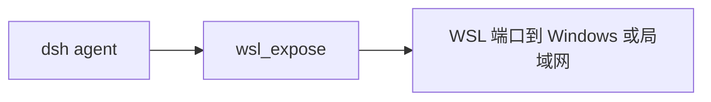

# dsh-wsl-expose

> **套件安装：** 见 [dsh-wsl-kit](https://github.com/173787247/dsh-wsl-kit)。推荐 `KIT_SET=llm` | `full`。故障树：[TROUBLESHOOTING.zh.md](https://github.com/173787247/dsh-wsl-kit/blob/master/docs/TROUBLESHOOTING.zh.md)。

DeepSeek Harness 工具 **`wsl_expose`**：建议或执行 Windows **portproxy**，让局域网客户端访问 WSL 内监听的服务。会读取 `.wslconfig` 的 `networkingMode`。

[English → README.md](./README.md)

## 在套件里的位置

建议 WSL 端口如何从 Windows 或局域网访问。本机聊天仍走 :3081/?token=。



整套关系图和版本快照：[dsh-wsl-kit 中文说明](https://github.com/173787247/dsh-wsl-kit/blob/master/README.zh.md)。本插件是 **0.2.2**（full，也在 llm）。不要把那份总表抄进本 README。


## 兼容性

| 项 | 值 |
|----|----|
| **插件** | `dsh-wsl-expose` **0.2.2** |
| **最低 dsh** | ≥ **0.1.2**（Windows 中继 `:3081` 一次性 `?token=`） |
| **最新验证** | 以 [dsh-wsl-kit 兼容性](https://github.com/173787247/dsh-wsl-kit#compatibility-2026-09) 为准（当前 **`0.1.7-alpha.2`**）— 套件唯一真源 |
| **套件档位** | `llm` / `full`（也可单独装） |
| **云端 Flash** | settings / `llm-deepseek` 使用 **`deepseek-flash`**（V4.1 Flash）；本插件不配置模型 id |
| **Agent Teams** | 上游实验包；本插件不依赖 |

套件版本地板：[`check-plugin-versions.sh`](https://github.com/173787247/dsh-wsl-kit/blob/master/scripts/check-plugin-versions.sh)。故障树：[TROUBLESHOOTING.zh.md](https://github.com/173787247/dsh-wsl-kit/blob/master/docs/TROUBLESHOOTING.zh.md)。

**范围：** 仅 LAN / 非本机 portproxy。本机 dsh UI 用套件中继 `:3081` + token，**不要**用 netsh 把 3080 暴露出去。

## 为什么需要

手机 / 另一台电脑要访问 WSL 里的开发端口时，才需要 Windows 侧发布端口。这和「本机 Windows 浏览器打开 dsh」不是一回事：

| 目标 | 做法 |
|------|------|
| **本机**浏览器聊 dsh | 套件 [`restart-dsh-web.sh`](https://github.com/173787247/dsh-wsl-kit/blob/master/scripts/restart-dsh-web.sh) → **`:3081?token=…`** |
| 把某 **dev server** 暴露给局域网 | `wsl_expose`（白名单端口；注意防火墙风险） |
| `dsh --host 0.0.0.0` | **禁止** — dsh 只绑 `127.0.0.1:3080` |

NAT 模式下 Windows localhost 转发可能不稳；mirrored 模式行为不同——工具会报告 `networkingMode`，避免瞎猜。

## 安装

```sh
curl -fsSL https://raw.githubusercontent.com/173787247/dsh-wsl-kit/master/install.sh | KIT_SET=llm bash
# 或单独：
dsh plugin --profile web add github:173787247/dsh-wsl-expose
```

重启 `dsh web`，开**新**会话。工具名：`wsl_expose`。

## 相关工具

- [`port_doctor`](https://github.com/173787247/dsh-wsl-port) — 端口是否在听
- [`check-dsh-health.sh`](https://github.com/173787247/dsh-wsl-kit/blob/master/scripts/check-dsh-health.sh) — 3080/3081 + token
- [`wslconfig_hint`](https://github.com/173787247/dsh-wsl-wslconfig) — mirrored vs NAT

## 测试

```sh
npm test
```

## 许可

MIT
